# Smart To-do list
**Listify**—we categorize your tasks, so you don’t have to.

*Our smart algorithm does the heavy lifting for your to-do lists.*

## Final Product

Key features:
1) Guests receives a cookie after adding a task and can return to register within 7 days. 
  *This provides the convenience to add tasks immediately without a lengthy sign-up.*
2) Tasks are automatically added to one of the to-do categories based on IAB taxonomy with an easy option to reclass to another to-do list.
  *The ParallelDot text classification API does the thinking for our users.*
3) Guest/login cookies persist for seven days or are cleared upon logout.

### Mobile View

#### Wireframe of landing page
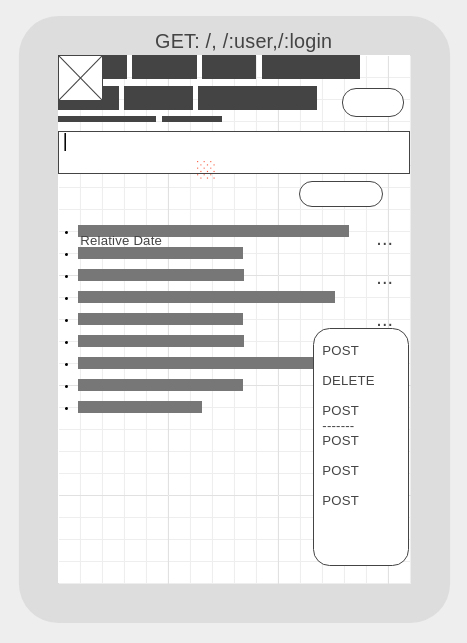

#### Wireframe of quick editing
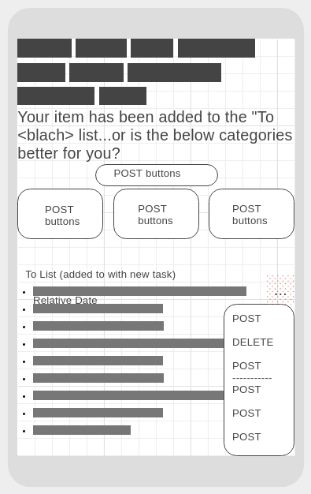

#### Landing page
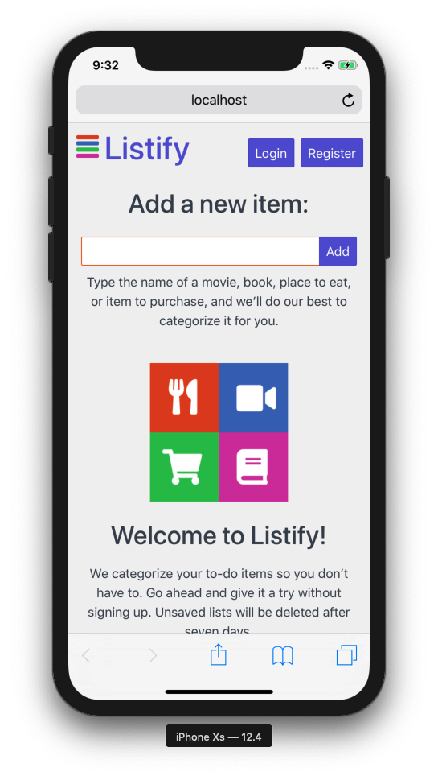

#### Adding a new item
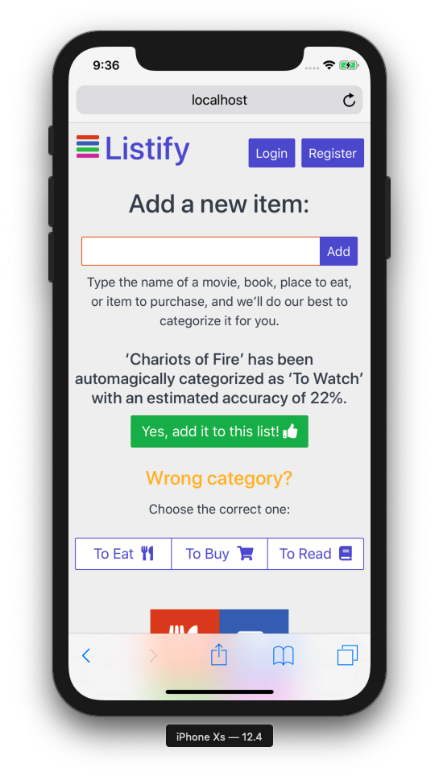

#### Logging in
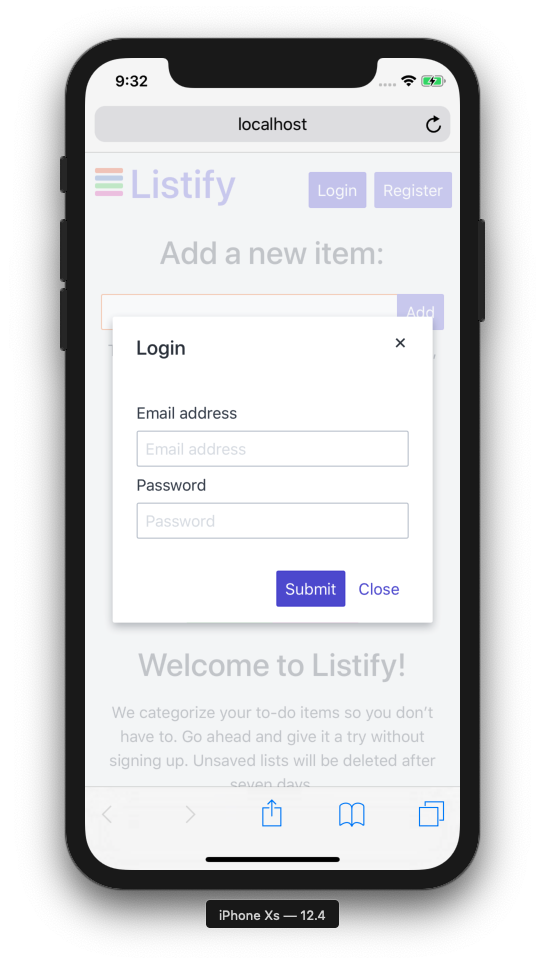

#### Logged in
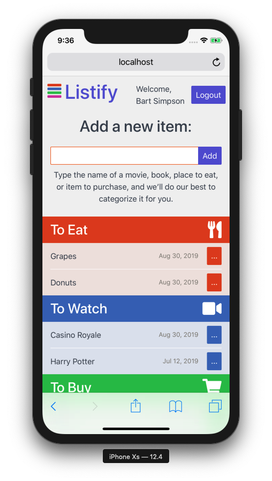

#### Editing an item
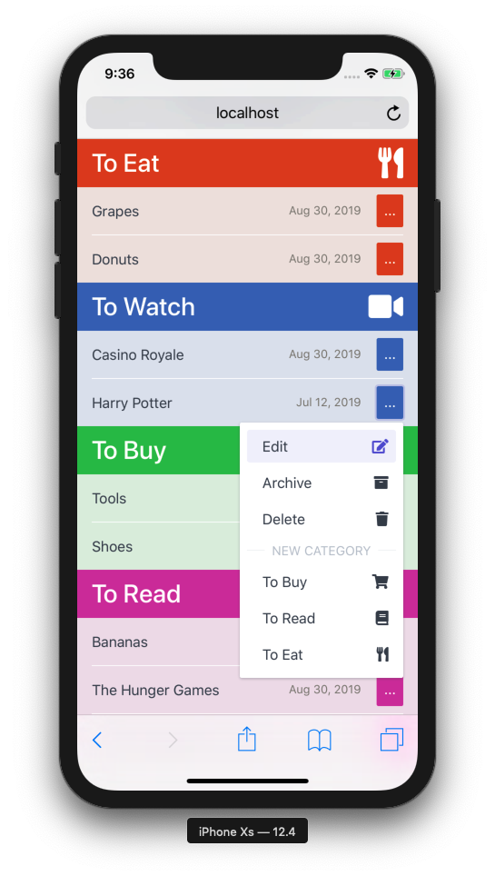


### Desktop View

#### Initial Wireframe
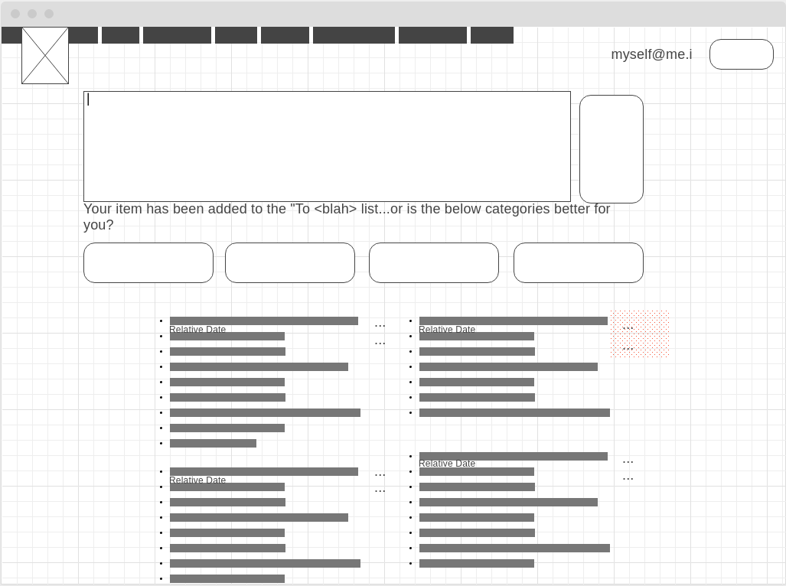

#### Homepage
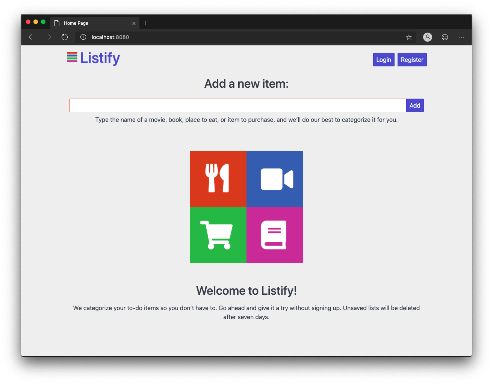

#### Adding a new item
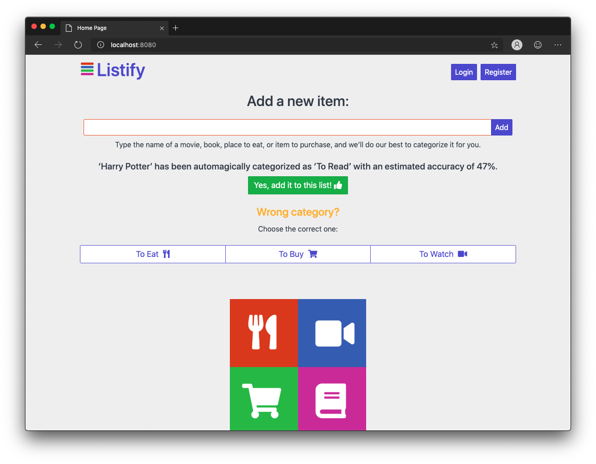

#### Items saved for guest user
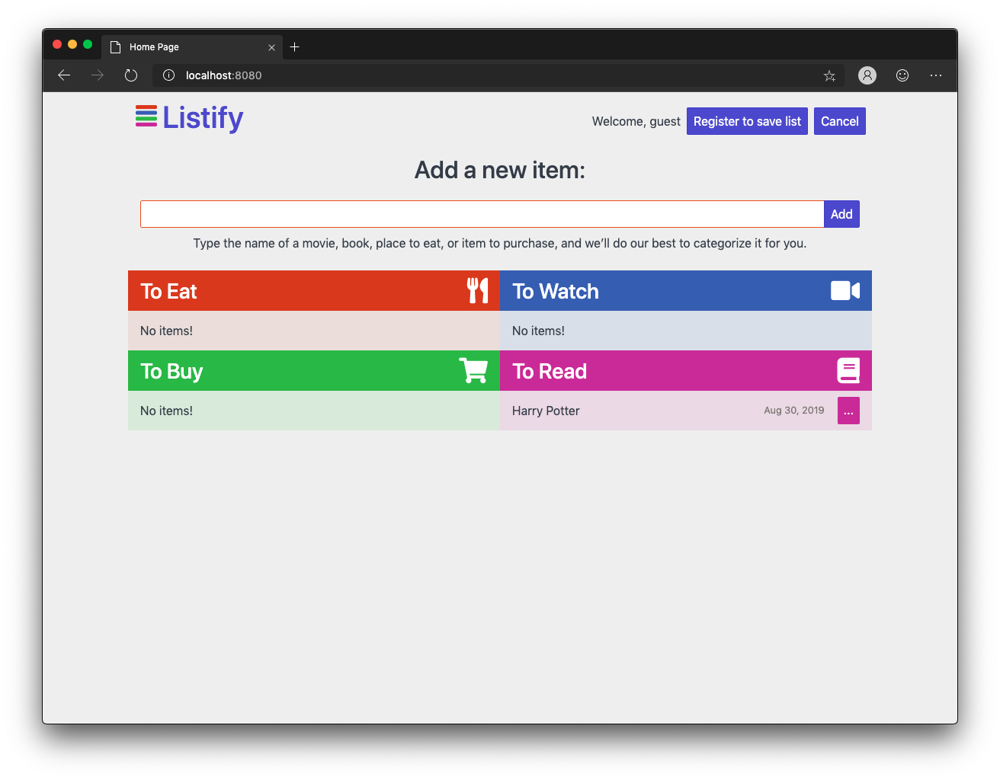

#### Registering
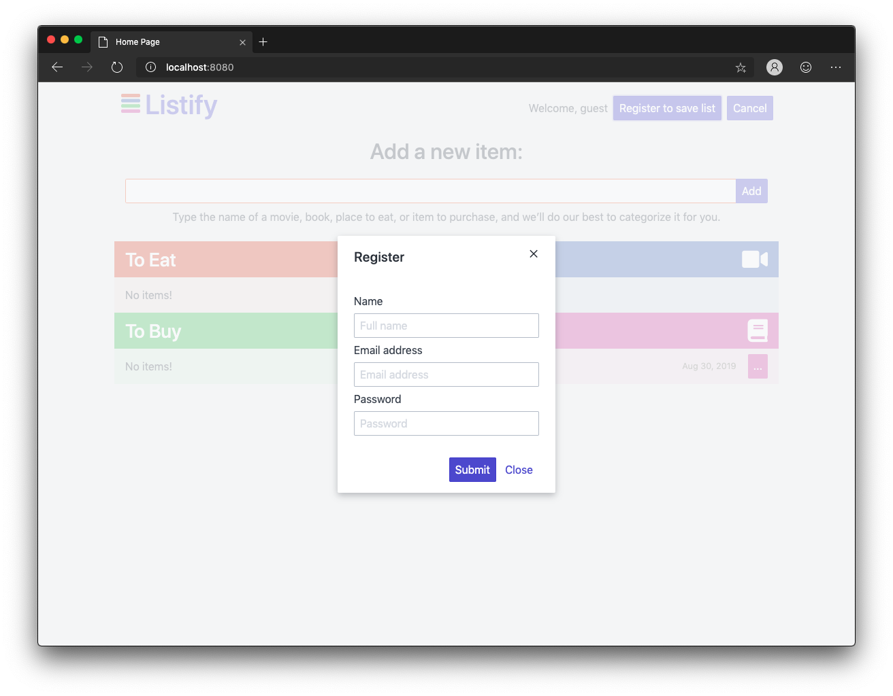

#### Logged In
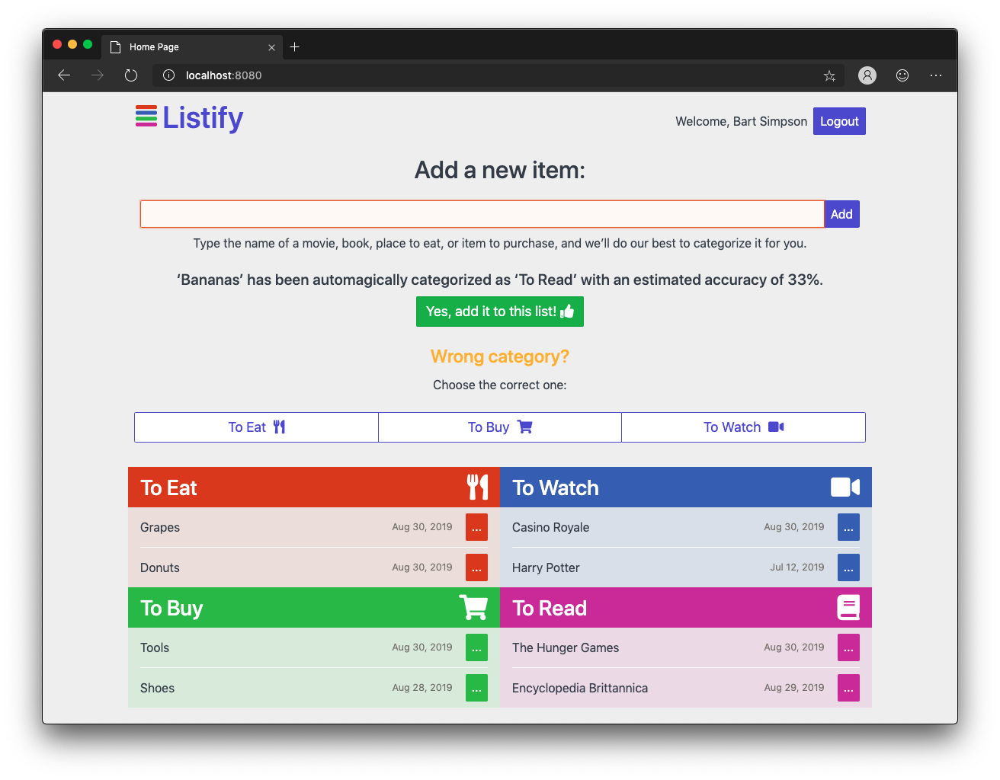

#### Editing an item
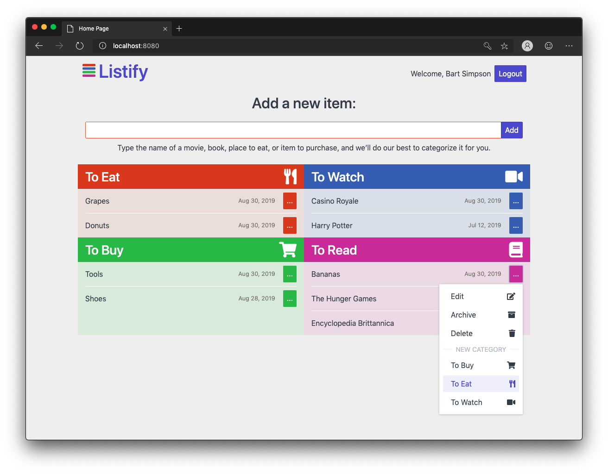

## Project Setup

### Dependencies

- node
- postgresql database
- bcrypt
- body-parser
- chalk
- cookie-session
- dotenv
- ejs
- express
- method-override
- morgan
- node-sass-middleware
- paralleldots
- pg
- pg-native
- spectre.css
- nodemon *devDependencies*

### Installation

1. Clone the repo.

2. Create a .env file

3. Update the .env file with the postgres database information. For example:
```
DB_HOST=localhost
DB_USER=user
DB_PASS=pass
DB_NAME=database
API_KEY=<See Step 4 below>
```

4. Request an api key from ParallelDots and add it to the .env file
```
https://user.apis.paralleldots.com/login 
```

5. Install node dependencies:
```
npm i
```

6. Fix to binaries for sass
```
npm rebuild node-sass
```

7. Start up the localhost server. The default port is 8080.
Note: nodemon is used, so you should not have to restart your server
```
npm run local
```

8. Open a new browser window and enter the local host with your port.  Chrome is preferred.
```
http://localhost:8080/
```

## Built With

* [Spectre](https://picturepan2.github.io/spectre/) - The CSS framework used
* [ParallelDots](https://www.paralleldots.com/text-classification) - Text Classification function
* [Postman](https://www.getpostman.com/) - For testing RESTful APIs

## Contributing

As this is a student project there is currently no process for submitting pull requests.

## Versioning

* [SemVer](http://semver.org/) for versioning: version 1.0.0.

## Authors

* [**Russell McWhae**](https://github.com/rmcwhae) - *Initial work*
* [**Michael Chui**](https://github.com/mikel-k-khui) - *Initial work*

## License

This project is licensed under the MIT License - see the [LICENSE.md](LICENSE.md) file for details

